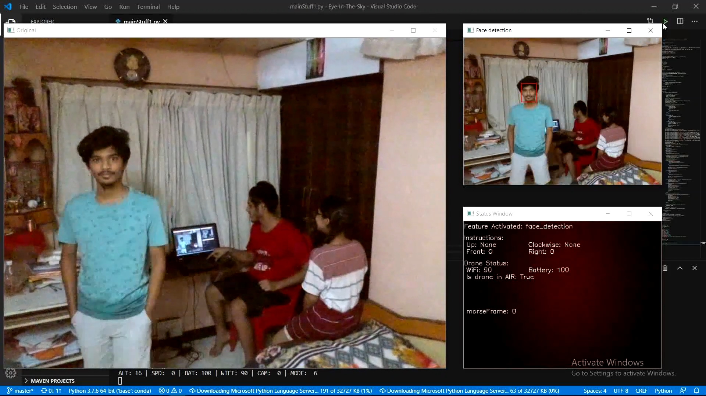

# Eye-In-The-Sky

   

## Introduction
A system application which can control a camera mounted drone(tested with: Dji Tello), and make it a semi-autonomous drone which can capture images or video without the help of a cameraman or a drone pilot. The drone will be able to identify faces in the captured footage in real time and then follows the user autonomously to keep the person in the video frame.

This was our final year project of engineering.

> Our project was funded by `KARNATAKA STATE COUNCIL FOR SCIENCE AND TECHNOLOGY(KSCST)`: [Link](https://www.kscst.org.in/spp/43_series/43S_SPP_Sanctioned_Projects_List.pdf).

## Requirements
As this project was built on Anaconda, I would suggest you to [install](https://docs.conda.io/projects/conda/en/latest/user-guide/install/windows.html) it for windows.

 1. `pip install imutils`.
 2. `pip install opencv-python`.
 3. ~`pip install djitellopy`~ (This library will be removed soon, as the library is very unreliable).
 4. `pip install tellopy` (While excuting this command if you get error, try this command first: `conda install av -c conda-forge`, and later `pip install tellopy` command will work fine).
 5. `pip install playsound`.
 
 > **Note**: The project was completed in 2 parts, ie first is `Face Detection and Drone Control` and second is `Gesture Detection`.
 
 > To test the gesture program `_testgesture_.py`, you need to install [OpenPose](https://github.com/CMU-Perceptual-Computing-Lab/openpose) with python API and place the `_testgesture_.py` and `openposepy.py` in its python folder and execute.
 
## Team Mates/Contributors
 1. [Princy Dsilva](https://github.com/princii16)
 2. [Rachel](https://github.com/rach636)
 3. [Shubha](https://github.com/shubha105)
 4. [Sushan Saplaiga](https://github.com/sushansapaliga)
